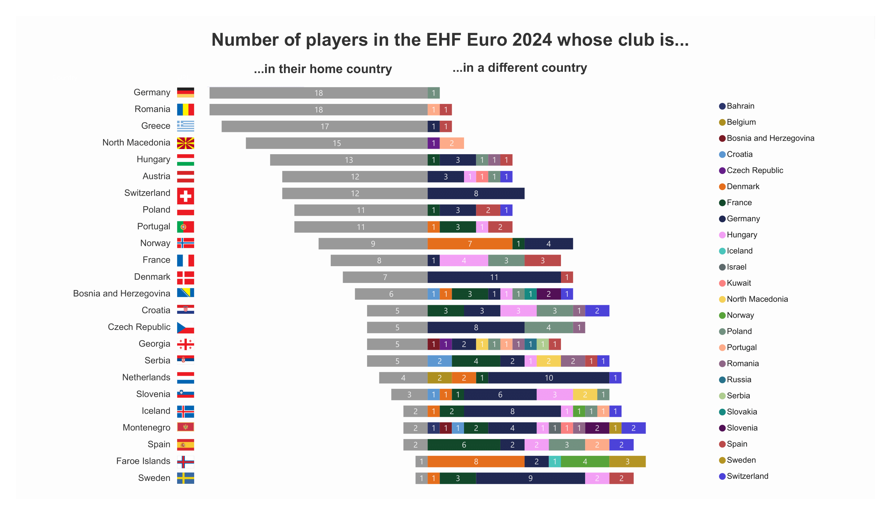
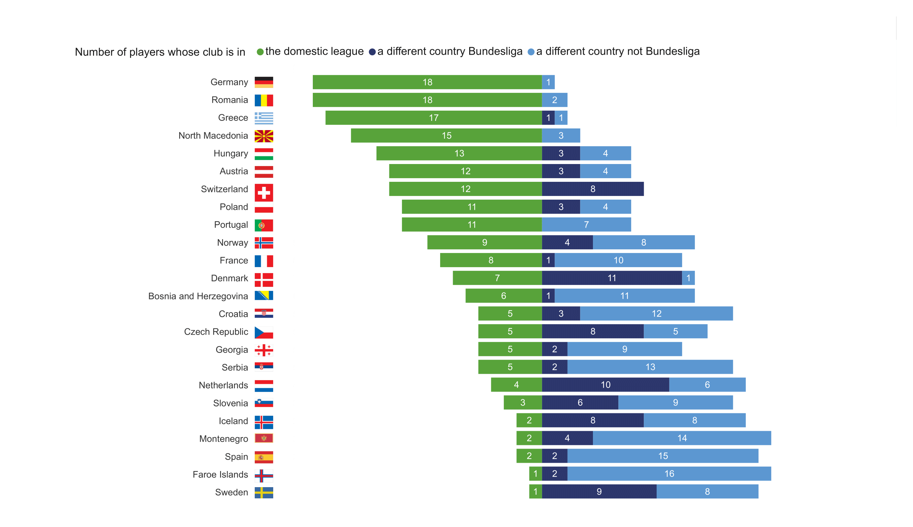
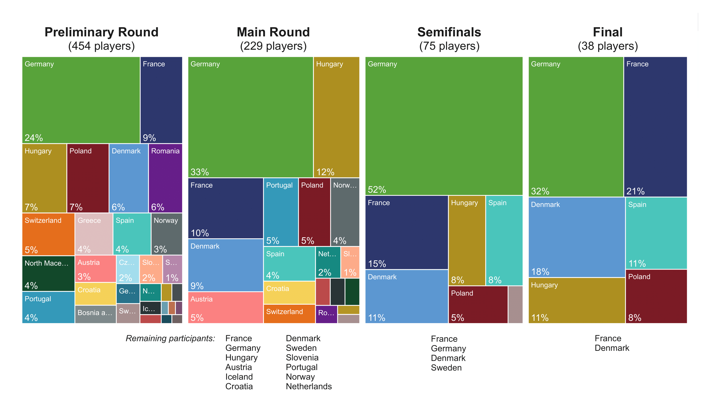

# EHF-Euro-2024-Squads

During the recently concluded EHF European Men's Handball Championship, I noticed that many of the top players from other countries seemed to be playing in the German Bundesliga. This prompted me to take a closer look at the club affiliations of all the participating teams, with a special focus on the Bundesliga.

I extracted the data from the [wikipedia](https://en.wikipedia.org/wiki/2024_European_Men%27s_Handball_Championship_squads) markup. The extraction, data processing and analysis was done in Python and is available [here](Euro_2024_Squads.ipynb). I also created some visualizations in Power BI.

## Some key results
There is a big difference between the teams when it comes to the club affiliation of the players. While almost all German players play in the Bundesliga, only one Swedish player actually plays for a Swedish club. The Bundesliga is by far the most popular "foreign" league with 91 non-German players.

Almost a quarter of the 454 participants play in the Bundesliga. The dominance of Bundesliga players becomes even more apparent when looking at the tournament progression.  52% of all players in the semifinals were Bundesliga players (without France it would be 68%). In the final it was still 32%, even though Germany did not make it to that stage of the tournament.

To back this up in a more scientific way, I calculated the **Spearman's Rho**: The correlation coefficient of 0.438 and a p-value of 0.032 indicate a significant positive correlation between the proportion of Bundesliga players and the achieved level (tournament stage).

